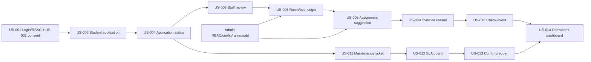

# Web Figma Handoff And Assignment

| Field | Value |
| --- | --- |
| Project | DormCare Hub / QLKTX Web |
| Status | Synced for Figma-first web UI handoff |
| Date | 2026-06-27 |
| Scope | Figma desktop web prototype first, React web UI later, mock-only |
| Figma file | `21WcpY1SegwWbh8zMq4nJb` - DormCare Hub MVP Prototype |
| Primary repo | `D:\QLKTX\Frontend-Web-QLKTX` |

## Purpose

Tài liệu này là file phân công chính cho 7 member dựng giao diện web trước trên Figma, sau đó mới tách task implement React theo folder sở hữu.

Phase hiện tại chỉ tập trung web UI. Không dựng native mobile, không backend/API, không Supabase, không real auth, không payment, không SIS sync, không service key. Figma prototype dùng desktop web `1440x1024`; frontend repo dùng mock data/local state khi đến giai đoạn code.

## Source Of Truth

| Decision | Source |
| --- | --- |
| MVP scope, priority, sprint | `docs/pm/product-backlog.md`, `docs/pm/release-plan-fixed-date.md` |
| Screen list, flow, sample data | `docs/pm/prototype-spec.md` |
| Done checklist | `docs/pm/definition-of-done.md` |
| Web route/folder architecture | `docs/frontend-architecture.md` |
| Web team rules | `docs/team-work-rules.md`, `AGENTS.md` |
| Figma assignment | this file |

Nếu có mâu thuẫn: ưu tiên `docs/pm` cho scope, `docs/frontend-architecture.md` cho route/folder, Figma file hiện tại cho visual, code hiện tại cho pattern implement.

## Current Figma Page Map

| Figma page | Owner | Purpose |
| --- | --- | --- |
| `00 - Tổng quan` | Member 1 | Cover, visual tokens, app shell reference, reusable handoff notes |
| `01 - Xác thực & Hồ sơ` | Member 2 | Login, role gate, consent, profile, auth handoff |
| `02 - Sinh viên` | Member 3 + Member 4 | Student core + student services |
| `03 - Nhân viên` | Member 5 + Member 6 | Staff operations A + staff operations B |
| `04 - Quản trị` | Member 7 | Admin governance/configuration |

Các page cũ trước đây không còn là source cho handoff hiện tại.

## Current MVP Flow Map



## Role Route Map

| Role | Routes |
| --- | --- |
| Auth | `/login`, `/profile` |
| Student | `/student/dashboard`, `/student/application`, `/student/room`, `/student/tickets`, `/student/invoices`, `/student/requests`, `/student/notifications` |
| Staff | `/staff/dashboard`, `/staff/applications`, `/staff/allocation`, `/staff/checkin-checkout`, `/staff/residents`, `/staff/maintenance`, `/staff/billing`, `/staff/tasks` |
| Admin | `/admin/dashboard`, `/admin/users`, `/admin/buildings-rooms`, `/admin/allocation-rules`, `/admin/reports-audit`, `/admin/settings` |

## Member Assignment

### Member 1 - Web Base / UI System / Sync

| Item | Detail |
| --- | --- |
| Main scope | App shell, router, shared layout, shadcn primitives, navigation, mock data contract, docs sync |
| Folders | `src/app`, `src/components`, `src/config`, `src/lib`, `src/styles`, `src/types`, `src/mocks/data`, root config, `docs` |
| Figma page | `00 - Tổng quan` |
| Figma frames | Cover, components/tokens, desktop app shell reference, route list, shared handoff notes |
| Output | Stable visual direction, shared UI contract, route/folder map, member handoff baseline |
| Must avoid | Building feature-specific UI inside member 2-7 folders unless coordinating shared integration |

Member 1 reviews dependency, route, shared UI, docs, and mock-data-contract changes.

### Member 2 - Auth / Shared Access

| Item | Detail |
| --- | --- |
| US-ID | `US-001`, `US-002` |
| Folders | `src/features/auth` |
| Routes | `/login`, `/profile` |
| Figma page | `01 - Xác thực & Hồ sơ` |
| Figma focus | Login, role gate, access denied, consent, profile/member state, portal entry handoff |
| Done focus | Login stays minimal, role destination clear, consent explicit, profile mock state usable |

Expected handoff: reviewer can enter Student, Staff, Admin portals from auth/profile flow without extra marketing copy.

### Member 3 - Student Core

| Item | Detail |
| --- | --- |
| US-ID | `US-003`, `US-004`, student-facing `US-006` |
| Folders | `src/features/student/dashboard`, `src/features/student/application`, `src/features/student/room` |
| Routes | `/student/dashboard`, `/student/application`, `/student/room` |
| Figma page | `02 - Sinh viên` |
| Figma frames | `SV 01`, `SV 02`, `SV 02A`, `SV 03`, `SV 03A`, `SV 03B`, `SV 04` |
| Screens | Student dashboard, application form, validation error, pending/approved/rejected status, current room/bed, roommates/assets |
| Done focus | Form validation, required evidence, status timeline, approved room `A-302`, bed `A-302-B4`, rejected edit loop |

Expected handoff: student can follow application draft -> submit -> pending -> approved room/bed or rejected edit.

### Member 4 - Student Services

| Item | Detail |
| --- | --- |
| US-ID | `US-011`, student-facing `US-013`; Phase 2 drafts `US-016`, `US-017`, `US-018` |
| Folders | `src/features/student/tickets`, `src/features/student/invoices`, `src/features/student/requests`, `src/features/student/notifications` |
| Routes | `/student/tickets`, `/student/invoices`, `/student/requests`, `/student/notifications` |
| Figma page | `02 - Sinh viên` |
| Figma frames | `SV 05`, `SV 06`, `SV 06A`, `SV 06B`, `SV 07`, `SV 08`, `SV 09` |
| Screens | Ticket create/list/detail, room/asset context, closed ticket, reopened ticket, requests, fee draft, notification draft |
| Done focus | Ticket has context/priority/description/photo placeholder/SLA preview; confirm and reopen actions are clear |

Expected handoff: student can create maintenance ticket, track SLA, confirm resolved, or reopen with reason. `SV 07` fees and `SV 09` notifications stay Phase 2/draft.

### Member 5 - Staff Operations A

| Item | Detail |
| --- | --- |
| US-ID | `US-005`, `US-008`, `US-009`, `US-010`, staff side `US-014` |
| Folders | `src/features/staff/dashboard`, `src/features/staff/applications`, `src/features/staff/allocation`, `src/features/staff/checkin_checkout` |
| Routes | `/staff/dashboard`, `/staff/applications`, `/staff/allocation`, `/staff/checkin-checkout` |
| Figma page | `03 - Nhân viên` |
| Figma frames | `12 Tổng quan`, `13 Đăng ký Review`, `14 Phân phòng`, `15 Check-in Checkout`, `20 Duyệt đơn Chi tiết`, `21`, `22`, `NV 05A`, `NV 05B`, `NV 06A`, `NV 07A`, `NV 07B`, `NV 10A`, `NV 10B` |
| Screens | Staff dashboard, review queue/detail, approve/reject states, ledger hold, assignment suggestion, override reason, check-in/out completion |
| Done focus | Review decision has reason, suggestion has rule reasons, override requires reason, ledger updates visually |

Expected handoff: staff can approve application, see suggested bed, override with audit reason, then complete check-in/out.

### Member 6 - Staff Operations B

| Item | Detail |
| --- | --- |
| US-ID | `US-012`, staff side `US-013`; service ops drafts |
| Folders | `src/features/staff/residents`, `src/features/staff/maintenance`, `src/features/staff/billing`, `src/features/staff/tasks` |
| Routes | `/staff/residents`, `/staff/maintenance`, `/staff/billing`, `/staff/tasks` |
| Figma page | `03 - Nhân viên` |
| Figma frames | `16 Cư trú`, `17 Sửa chữa Ops`, `18 Đối soát`, `19 Tasks/Shifts`, `23 SLA Chi tiết`, `NV 12A`, `NV 12B`, `NV 12C` |
| Screens | Resident search, maintenance ops board, SLA detail, classify/assign, resolved, reopened, billing/tasks draft |
| Done focus | Ticket priority/SLA visible, assignee/due date clear, overdue easy to identify, resolve/reopen loop visible |

Expected handoff: staff can triage ticket, assign assignee/due date, resolve, then handle reopen. Billing and tasks stay Phase 2/draft.

### Member 7 - Admin / Governance / Configuration

| Item | Detail |
| --- | --- |
| US-ID | `US-001` admin RBAC, admin side `US-006`, `US-008`, `US-009`, `US-014`, optional `US-015`; Phase 2 drafts `US-019`, `US-020`, `US-021` |
| Folders | `src/features/admin` |
| Routes | `/admin/dashboard`, `/admin/users`, `/admin/buildings-rooms`, `/admin/allocation-rules`, `/admin/reports-audit`, `/admin/settings` |
| Figma page | `04 - Quản trị` |
| Figma frames | `20 Tổng quan`, `21 Người dùng RBAC`, `22 Buildings and Rooms`, `23 Allocation Rules`, `24 Báo cáo and Audit`, `25 System Cài đặt`, `26 Audit Chi tiết`, `27 RBAC Chi tiết`, `QT 01A`, `QT 02A`, `QT 02B`, `QT 02C`, `QT 03A`, `QT 03B`, `QT 04A`, `QT 04B`, `QT 05A`, `QT 06A`, `QT 07A` |
| Screens | Admin dashboard, KPI drilldown, RBAC grant/deny/negative case, rooms/beds, maintenance hold, allocation rule draft/publish block, semester settings, audit reviewed, reports draft |
| Done focus | Governance actions show reason/audit hint, admin-only config separated from staff ops, Phase 2 imports/exports disabled/draft |

Expected handoff: admin can demo dashboard -> RBAC -> room/bed config -> allocation rules -> settings/audit guardrails.

## Figma-First Handoff Flow

1. Member 1 validates page names, visual tokens, app shell, route list.
2. Member 2 completes auth flow entry and role handoff notes.
3. Member 3 completes student core flow.
4. Member 4 completes student services flow and marks Phase 2 screens as draft.
5. Member 5 completes staff application/allocation/check-in flow.
6. Member 6 completes staff resident/maintenance/SLA flow and marks Phase 2 screens as draft.
7. Member 7 completes admin governance/configuration flow.
8. Member 1/PM reviews end-to-end prototype coverage before React implementation starts.

## Cross-Member Data Contract

| Entity | Canonical sample |
| --- | --- |
| Student | `SV2302700162 - Pham Hoang Hai - Male - K2023 - IT` |
| Application | `APP-204` / `APP-2026-001 - Pending Review - Preference: Building A, quiet room` |
| Room | `A-302 - Capacity 4 - Occupied 3 - Available` |
| Bed | `A-302-B4 - Available` |
| Ticket | `MT-2026-011 - Fan not working - Normal - Due 48 hours` |
| Asset QR | `QR-A302-FAN01 - Fan in Room A-302` |
| Dashboard KPI | `Occupancy 87%`, `Pending applications 18`, `Overdue tickets 4`, `Available beds 26` |

Nếu nhiều member cần cùng một mock object khi code, đưa vào `src/mocks/data` qua Member 1. Không copy thành nhiều version khác nhau.

## Implementation Rules For Every Member

1. Figma trước, code sau.
2. Chỉ làm trong page/folder sở hữu.
3. Dùng style hiện tại: sidebar burgundy, nền hồng nhạt, card viền hồng, accent xanh/vàng.
4. Web Figma chỉ cần desktop `1440x1024`; không thêm native/mobile frames.
5. React phase dùng shadcn primitives và `lucide-react`.
6. React phase dùng mock/local state only; không Supabase/API/fetch/Axios/secrets/new dependencies.
7. Mọi action nhạy cảm phải có reason/audit hint: approve/reject, override, role grant/deny, hold, publish rule.
8. Mọi dashboard KPI phải click hoặc dẫn được đến list/action.
9. Phase 2 items được đánh dấu draft/disabled, không nối vào MVP chính.

## Definition Of Done For A Figma Flow

| Area | Done condition |
| --- | --- |
| Page | Đúng page `00-04`, đúng owner |
| Size | New frame dùng desktop web `1440x1024` |
| Scope | Bám assigned `US-ID`, không kéo Phase 2 thành MVP |
| Visual | Đồng bộ visual hiện tại, không đổi style lẻ |
| Components | Có reusable board/component rõ cho từng role page |
| States | Default, loading, empty, error, validation, approved/rejected/closed/reopened nếu liên quan |
| Flow | Prototype links đủ nhánh chính và state branch |
| Access | Role-specific controls không lẫn sang portal khác |
| Sensitive action | Reason/audit hint có mặt |
| Cleanliness | Không overlap text, không nested cards, không copy thừa |

## React Handoff Template

```text
Owner:
US-ID:
Figma page/frame:
Docs checked:
Routes:
Files planned/changed:
Mock data used/added:
States covered:
Commands run:
Evidence:
Known gaps:
Needs Member 1 sync:
```

## Current Sync Status

As of 2026-06-27:

| Area | Status |
| --- | --- |
| Assignment file | Synced to current Figma pages `00-04` |
| Team split | 7 members mapped to web routes, folders, and Figma frames |
| Backend refs | Removed from active handoff; future-only |
| Mobile/native | Removed from Figma scope |
| Phase 2 | Kept draft/disabled, not MVP blockers |
| Root assignment | `D:\QLKTX\TEAM_ASSIGNMENT.md` should mirror this web-first scope |

Next handoff step: members finish/review assigned Figma frames first, then Member 1/PM approves React implementation split.
