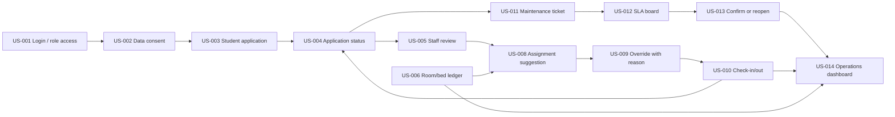

# Web Handoff Flow And Assignment

| Field | Value |
| --- | --- |
| Project | DormCare Hub / QLKTX Web |
| Status | Ready for member handoff |
| Date | 2026-06-25 |
| Scope | Frontend web MVP, mock-only phase |
| Primary repo | `D:\QLKTX\Frontend-Web-QLKTX` |

## Purpose

Tài liệu này dùng để bàn giao công việc cho 7 member làm web UI song song. Nội dung tập trung vào kiến trúc luồng, ranh giới folder, route, user story, Figma page, API tham chiếu và tiêu chuẩn Done.

Trong phase hiện tại, web frontend chỉ dựng UI responsive bằng mock data. Không nối Supabase, không gọi backend thật, không thêm service key, không tạo datasource/repository layer.

## Source Of Truth

| Decision | Source |
| --- | --- |
| MVP scope, priority, sprint | `docs/pm/product-backlog.md`, `docs/pm/release-plan-fixed-date.md` |
| Screen list, flow, sample data | `docs/pm/prototype-spec.md` |
| Done checklist | `docs/pm/definition-of-done.md` |
| Route/folder architecture | `docs/frontend-architecture.md` |
| Team ownership | this file, `../AGENTS.md`, root `D:\QLKTX\TEAM_ASSIGNMENT.md` |
| Future API contract | `D:\QLKTX\Backend-QLKTX\docs\api-map.md` |

Nếu có mâu thuẫn khi bàn giao: ưu tiên `docs/pm` cho scope, `docs/frontend-architecture.md` cho route/folder, và code hiện tại cho pattern implement.

## Current Architecture

```text
src/main.tsx
  -> AppProviders
  -> AppRouter
  -> RoleLayout
  -> AppSidebar
  -> feature page
  -> mock data / local state
  -> shadcn UI + Tailwind
```

Current data boundary:

```text
screen -> mock data/local state -> UI
```

Future backend boundary, chưa implement trong phase này:

```text
screen -> feature hooks/state -> repositories -> API/Supabase datasource
```

## Folder Boundary

| Path | Owner | Rule |
| --- | --- | --- |
| `src/app` | Member 1 | Router, providers, role layout. Feature member không tự sửa route lớn. |
| `src/components/ui` | Member 1 | shadcn primitives only. Không overwrite nếu chưa thống nhất. |
| `src/components/common` | Member 1 coordinates | Component dùng bởi ít nhất 2 feature. |
| `src/components/navigation` | Member 1 | Sidebar/nav shell. |
| `src/config`, `src/lib`, `src/styles`, `src/types` | Member 1 | Shared constants, helpers, tokens, types. |
| `src/mocks/data` | Member 1 coordinates | Shared mock contract. Feature member đề xuất shape nếu cần. |
| `src/features/auth` | Member 2 | Auth, role access, profile, consent. |
| `src/features/student/dashboard`, `application`, `room` | Member 3 | Student core. |
| `src/features/student/tickets`, `invoices`, `requests`, `notifications` | Member 4 | Student services. |
| `src/features/staff/dashboard`, `applications`, `allocation`, `checkin_checkout` | Member 5 | Staff operations A. |
| `src/features/staff/residents`, `maintenance`, `billing`, `tasks` | Member 6 | Staff operations B. |
| `src/features/admin` | Member 7 | Admin, governance, reporting. |

## MVP Flow Map



## Role Route Map

| Role | Routes |
| --- | --- |
| Auth | `/login`, `/profile` |
| Student | `/student/dashboard`, `/student/application`, `/student/room`, `/student/tickets`, `/student/invoices`, `/student/requests`, `/student/notifications` |
| Staff | `/staff/dashboard`, `/staff/applications`, `/staff/allocation`, `/staff/checkin-checkout`, `/staff/residents`, `/staff/maintenance`, `/staff/billing`, `/staff/tasks` |
| Admin | `/admin/dashboard`, `/admin/users`, `/admin/buildings-rooms`, `/admin/allocation-rules`, `/admin/reports-audit`, `/admin/settings` |

## Member Assignment

### Member 1 - Web Base / UI System / Sync

| Item | Detail |
| --- | --- |
| Scope | App shell, router, layout, shadcn primitives, navigation, shared mock data, docs sync. |
| Folders | `src/app`, `src/components`, `src/config`, `src/lib`, `src/styles`, `src/types`, `src/mocks/data`, root configs, `docs`. |
| Figma | `00 - Design System`, `10 - Workflow Maps & Handoff`. |
| Output | Stable routes, shared components, mock contracts, build/lint/typecheck baseline. |
| Must avoid | Building feature UI inside another member folder unless fixing shared integration. |

Member 1 also reviews any dependency, shared UI, route, docs, or mock-data-contract change.

### Member 2 - Auth / Shared Access

| Item | Detail |
| --- | --- |
| US-ID | `US-001`, `US-002` |
| Folders | `src/features/auth` |
| Routes | `/login`, `/profile` |
| Figma | `01 - Auth & Shared` |
| Screens | Login/RBAC, role gate, access denied, profile, privacy consent. |
| Backend ref | `GET /api/auth/me`, `PATCH /api/profiles/me` |
| Done focus | Role destination clear, no real auth client, consent action explicit, profile mock state usable. |

Expected handoff: login lets reviewer enter Student, Staff, Admin portals; consent/privacy state is visible before student application entry.

### Member 3 - Student Core

| Item | Detail |
| --- | --- |
| US-ID | `US-003`, `US-004`, student side of `US-006` |
| Folders | `src/features/student/dashboard`, `src/features/student/application`, `src/features/student/room` |
| Routes | `/student/dashboard`, `/student/application`, `/student/room` |
| Figma | `02 - Student Portal`, `03 - Student Application & Residency` |
| Screens | Student dashboard, application form, application status, current room/bed, roommates, assets. |
| Backend ref | `GET /api/dashboard/student`, `POST /api/applications`, `POST /api/applications/:id/submit`, `POST /api/applications/:id/confirm`, `GET /api/student-rooms/current`, `GET /api/student-rooms/roommates` |
| Done focus | Form validation state, status timeline, pending/approved/rejected states, room assignment details. |

Expected handoff: student can follow application draft -> submitted -> review/status -> approved room/bed using mock data.

### Member 4 - Student Services

| Item | Detail |
| --- | --- |
| US-ID | `US-011`, student side of `US-013`; Phase 2 drafts `US-016`, `US-017`, `US-018` if needed |
| Folders | `src/features/student/tickets`, `src/features/student/invoices`, `src/features/student/requests`, `src/features/student/notifications` |
| Routes | `/student/tickets`, `/student/invoices`, `/student/requests`, `/student/notifications` |
| Figma | `04 - Student Services` |
| Screens | Ticket create/list/detail, QR context ticket form, confirm/reopen ticket, invoices draft, requests, notifications. |
| Backend ref | `GET/POST /api/tickets`, `POST /api/tickets/:id/confirm`, `GET /api/invoices`, `POST /api/invoices/:id/payments`, `GET/POST /api/requests`, `POST /api/requests/:id/submit`, `GET /api/notifications`, `POST /api/notifications/:id/read` |
| Done focus | Ticket requires context, priority, description, photo placeholder, SLA preview, confirm/reopen state. |

Expected handoff: student can create a maintenance ticket from room/equipment context and later accept or reopen the resolution.

### Member 5 - Staff Operations A

| Item | Detail |
| --- | --- |
| US-ID | `US-005`, `US-008`, `US-009`, `US-010`, staff side of `US-014` |
| Folders | `src/features/staff/dashboard`, `src/features/staff/applications`, `src/features/staff/allocation`, `src/features/staff/checkin_checkout` |
| Routes | `/staff/dashboard`, `/staff/applications`, `/staff/allocation`, `/staff/checkin-checkout` |
| Figma | `05 - Staff Dashboard & Application Review`, `06 - Staff Room-Bed & Allocation` |
| Screens | Staff dashboard, review queue/detail, assignment suggestion, override modal, check-in/out checklist. |
| Backend ref | `GET /api/dashboard/staff`, `GET /api/applications`, `POST /api/applications/:id/review`, `POST /api/applications/:id/assign`, `POST /api/applications/:id/check-in`, `POST /api/applications/:id/cancel` |
| Done focus | Review decision has reason, suggestion has rule reasons, override requires reason, ledger state updates visually. |

Expected handoff: staff can approve an application, see suggested bed with explanation, override with mandatory reason, then check student in.

### Member 6 - Staff Operations B

| Item | Detail |
| --- | --- |
| US-ID | `US-012`, staff side of `US-013`; service ops drafts |
| Folders | `src/features/staff/residents`, `src/features/staff/maintenance`, `src/features/staff/billing`, `src/features/staff/tasks` |
| Routes | `/staff/residents`, `/staff/maintenance`, `/staff/billing`, `/staff/tasks` |
| Figma | `07 - Staff Operations` |
| Screens | Resident search, SLA board, ticket detail, billing reconciliation draft, tasks/shifts. |
| Backend ref | `GET /api/profiles?role=student&search=`, `GET /api/tickets`, `POST /api/tickets/:id/assign`, `POST /api/tickets/:id/status`, `POST/PATCH /api/invoices`, `POST /api/invoices/:id/reconcile`, `/api/staff/shifts`, `/api/tasks` |
| Done focus | Ticket priority/SLA state visible, assignment/resolution actions clear, overdue ticket easy to identify. |

Expected handoff: staff can triage ticket, assign assignee/due date, move status, and show waiting-student-confirm or reopened state.

### Member 7 - Admin / Governance / Reporting

| Item | Detail |
| --- | --- |
| US-ID | admin side of `US-006`, admin side of `US-014`; optional `US-015`; Phase 2 `US-020`, `US-021` drafts |
| Folders | `src/features/admin` |
| Routes | `/admin/dashboard`, `/admin/users`, `/admin/buildings-rooms`, `/admin/allocation-rules`, `/admin/reports-audit`, `/admin/settings` |
| Figma | `08 - Admin Governance`, `09 - Reports, Audit & Phase 2` |
| Screens | Admin dashboard, users/RBAC, buildings/rooms/assets, allocation rules, reports/audit, settings. |
| Backend ref | `POST/PATCH /api/buildings`, `POST/PATCH /api/rooms`, `GET /api/rooms/:id/residents`, `/api/allocation-rules`, `/api/audit-logs`, `PATCH /api/profiles/:id` |
| Done focus | Room/bed ledger scanability, admin-only controls separated, deferred integrations visibly marked as deferred. |

Expected handoff: admin can inspect buildings, rooms, beds, statuses, user roles, allocation rules, and audit/reporting placeholders.

## Cross-Member Data Contracts

Use shared sample language from `docs/pm/prototype-spec.md`:

| Entity | Canonical sample |
| --- | --- |
| Student | `SV2302700162 - Pham Hoang Hai - Male - K2023 - IT` |
| Application | `APP-2026-001 - Pending Review - Preference: Building A, quiet room` |
| Room | `A-302 - Capacity 4 - Occupied 3 - Available` |
| Bed | `A-302-B4 - Available` |
| Ticket | `MT-2026-011 - Fan not working - Normal - Due 48 hours` |
| Asset QR | `QR-A302-FAN01 - Fan in Room A-302` |
| Dashboard KPI | `Occupancy 87%`, `Pending applications 18`, `Overdue tickets 4`, `Available beds 26` |

If more than one member needs the same mock object, move it to `src/mocks/data` through Member 1 coordination. Do not copy-paste divergent versions inside feature folders.

## Implementation Rules For Every Member

1. Work only inside owned folders unless Member 1 coordinates shared changes.
2. Use `src/components/ui` shadcn primitives and `lucide-react` icons.
3. Keep UI operational and dense; no marketing landing pages.
4. Include default state plus relevant loading, empty, error, validation, and mobile states.
5. Do not add Supabase/API clients, `fetch`, Axios, secrets, env vars, or new dependencies.
6. Do not modify route map, shared layout, shared UI, or mock contract without handoff.
7. Every sensitive action must show reason/audit hint: approval/rejection, assignment override, status change, role change.
8. Every dashboard KPI should link visually to a list/action.

## Per-Task Flow

```text
read docs -> identify US-ID -> check Figma frame -> inspect current feature page
  -> implement UI with mock/local state
  -> run checks
  -> write handoff note
```

Required checks before handoff:

```bash
npm run typecheck
npm run lint
npm run build
```

Existing acceptable lint baseline may include React Refresh warnings from shadcn variant exports. New feature code should not add lint errors.

## Member Handoff Template

```text
Owner:
US-ID:
Jira:
Figma page/frame:
Docs checked:
Routes:
Files changed:
Mock data used/added:
States covered:
Commands run:
Evidence:
Known gaps:
Needs Member 1 sync:
```

## Definition Of Done For A Screen

| Area | Done condition |
| --- | --- |
| Render | Route opens and page is not blank. |
| Scope | Matches assigned `US-ID` and MVP/Phase label. |
| UI | Uses shadcn primitives, lucide icons, responsive layout. |
| Data | Uses mock/local state only. |
| States | Default plus required loading/empty/error/validation/mobile states. |
| Access | Role-specific controls do not leak into unrelated portal. |
| Sensitive action | Reason/audit hint exists where required. |
| Dashboard | KPI connects to a visible list/action. |
| Quality | `typecheck`, `lint`, `build` pass before merge/handoff. |

## Current Baseline

As of 2026-06-25:

| Area | Status |
| --- | --- |
| App shell/router/layout | Created |
| shadcn primitives | Installed base set |
| Feature pages | Mostly placeholder `ModulePage` wrappers |
| Data mode | Mock-only |
| Frontend `typecheck` | Pass |
| Frontend `lint` | Pass with existing shadcn Fast Refresh warnings |
| Backend dependency state | Backend is reference target; current web phase does not depend on it |

Next handoff step: assign each member one owned feature slice, replace placeholder `ModulePage` with real UI inside that member's folder, then run checks and record the handoff template.
