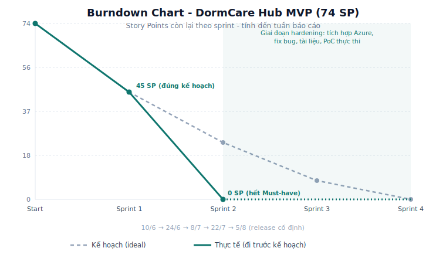
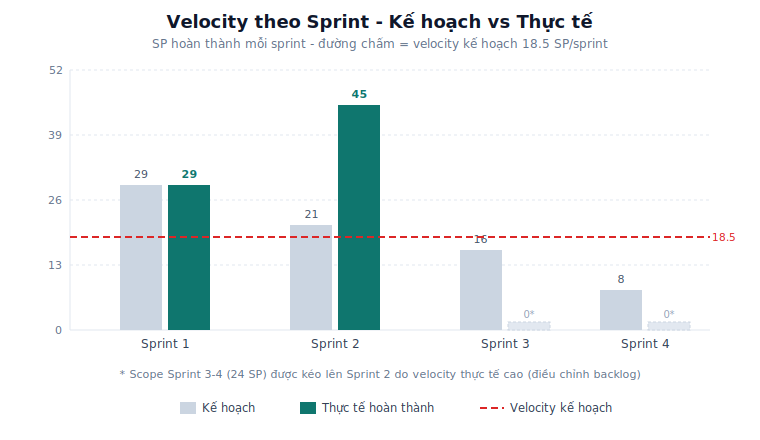

# Báo Cáo Tiến Độ Dự Án - Tuần 10

| Field | Value |
| --- | --- |
| Project | DormCare Hub - School Dormitory Management System |
| Document ID | DCH-PMO-PROGRESS-W10 |
| Version | 1.0 |
| Status | Progress report for review/demo |
| Owner | Group 3 |
| Updated | 2026-07-06 |
| Kỳ báo cáo | 2026-06-10 -> 2026-07-15 |

## Tóm tắt

Tính đến tuần 10, 13/13 Must Have story (74 SP) đã demo được trên môi trường thật, sớm hơn kế hoạch khoảng 1.5 sprint. First release đã có từ 2026-07-05 với React frontend, backend Azure và Supabase PostgreSQL. Nhóm báo cáo trung thực các điểm chưa OK: scope creep MoMo/notification, `DEV_AUTH_BYPASS` còn bật, coverage 70% chưa đo, Azure free tier có thể cold start.

## Tiến độ tổng thể

| Mốc | Kế hoạch | Thực tế |
| --- | --- | --- |
| Số sprint | 4 sprint x 2 tuần | Giữ nguyên |
| Hết Sprint 1 | Còn 45 SP | Còn 45 SP |
| Hết Sprint 2 | Còn 24 SP | Còn 0 SP Must-have |
| Sprint 3-4 | Hoàn thành maintenance/dashboard | Chuyển sang hardening + pilot readiness |
| Release chính thức | 2026-08-05 | Giữ nguyên, có buffer |

## Burndown

| Thời điểm | SP còn lại kế hoạch | SP còn lại thực tế | Ghi chú |
| --- | ---: | ---: | --- |
| Start | 74 | 74 | Baseline MVP |
| Hết Sprint 1 | 45 | 45 | Đúng kế hoạch |
| Hết Sprint 2 | 24 | 0 | Sớm khoảng 1.5 sprint |
| Hết Sprint 3 | 8 | 0 dự kiến | Hardening |
| Hết Sprint 4 | 0 | 0 dự kiến | Release đúng hạn |

## Velocity

| Sprint | Kế hoạch | Thực tế | Ghi chú |
| --- | ---: | ---: | --- |
| Sprint 1 | 29 SP | 29 SP | Foundation + mock UI đúng kế hoạch |
| Sprint 2 | 21 SP | 45 SP | Kéo sớm US-011 -> US-014 và tích hợp backend thật |
| Baseline Phase 2 | 18.5 SP/sprint | Không đổi | Không dùng velocity đột biến làm cam kết |

## Điều chỉnh backlog

| Sprint | Kế hoạch gốc | Điều chỉnh thực tế |
| --- | --- | --- |
| S1 | US-001, US-002, US-003, US-004, US-006 | Giữ nguyên |
| S2 | US-005, US-008, US-009, US-010 | Kéo sớm US-011, US-012, US-013, US-014 |
| S3 | Maintenance/SLA | Hardening, QR lookup UI, KPI drilldown, UAT |
| S4 | Operations dashboard | Stabilization, release packaging, demo readiness |

## Vận hành đã OK

- 13/13 Must story có màn hình và flow demo.
- PoC bắt được TC-03 và đã fix.
- RBAC negative cases pass.
- Traceability story -> UI -> API -> test đã có.
- Dashboard KPI có hướng hành động, không chỉ trang trí.
- Demo có thể chạy với backend/database thật.

## Chưa OK và giải pháp

| Vấn đề | Rủi ro | Giải pháp |
| --- | --- | --- |
| MoMo/notification vào sớm | Scope creep, vi phạm release gate | Lập change log hồi tố, label beyond-MVP |
| `DEV_AUTH_BYPASS` trên public demo | Mạo danh user nếu biết header | Tắt bypass, phát hành JWT thật trước pilot |
| Coverage 70% chưa đo | DoD chưa đủ evidence module coverage | Thêm coverage report cho auth/RBAC, assignment, SLA, admin |
| Azure free tier cold start | Demo chậm lần đầu | Mở `/health` trước demo, chuẩn bị video fallback |

## Kết luận

Dự án sớm hơn kế hoạch ở phạm vi Must-have, nhưng buffer S3-S4 phải dùng cho hardening và pilot readiness. Nhóm không nên thêm scope mới trước khi xử lý auth, coverage, UAT và change control cho Phase 2/deferred items.

